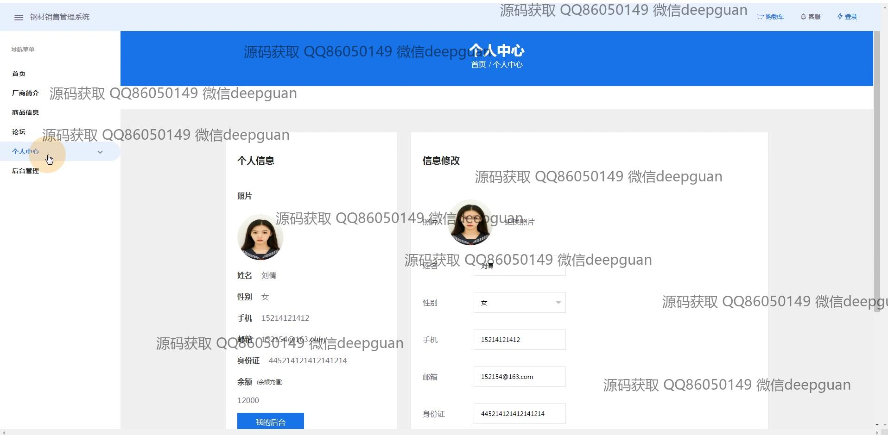

<h1 align="center">建材钢材销售管理系统前端vue</h1>

## 简介
建材钢材销售管理系统：角色分为管理员、用户；功能包括用户管理、商品管理、订单管理、论坛互动、及全面的信息维护等模块。通过Vue框架实现高效管理和数据操作。    --计算机毕业设计源码；毕设源码；java毕业设计源码

## 联系方式

<h3 align="center">获取完整代码与数据库文件 + 微信：deepguan QQ: 86050149 QQ群: 783742310</h3>

<h3 align="center">可帮忙远程部署 包运行成功！提供远程部署、修改代码、设计文档指导、代码讲解等服务！</h3>

## 功能介绍（完整见运行截图）
管理员：基本功能包括登录、注册、退出，管理和编辑厂商信息、商品信息、订单以及论坛。支持添加新商品，编辑商品详细信息并上传图片。提供用户管理模块，用于查看和编辑用户基本信息，设有修改密码和退出功能。能够管理订单状态，进行数据查询及导出，提高业务处理效率。

用户：基本功能涵盖登录、注册、退出，能够浏览商品列表，搜索商品信息，查看商品详情，并添加至购物车进行结算。个人中心支持编辑个人信息，如姓名、联系方式和地址，查看订单状态，管理收藏商品及历史评论。用户可参与论坛互动，发表和评论帖子，并在系统中查看个人账户余额和订单历史。

访客：无需账号登录即可浏览首页、厂商简介和商品基本信息，查看热门商品推荐及自然风光图展示。可以通过主导航栏快速访问商品列表，了解店铺以及平台提供的各类信息。使用注册功能创建用户账户，从而获取更多购物与管理权限。

系统管理者：负责后台管理及系统维护，包含检测和优化性能，确保数据安全。支持审批用户注册信息，分析销售数据及用户行为，为营销策略提供数据支持。监控论坛内容，维持良好的用户互动环境，同时更新维护系统的各类视图模板及功能模块。

## 运行截图

本代码来源于网络,仅供学习参考使用!

